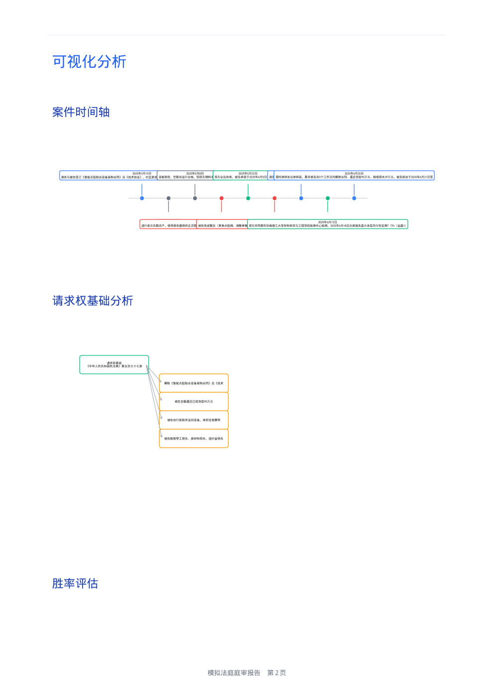
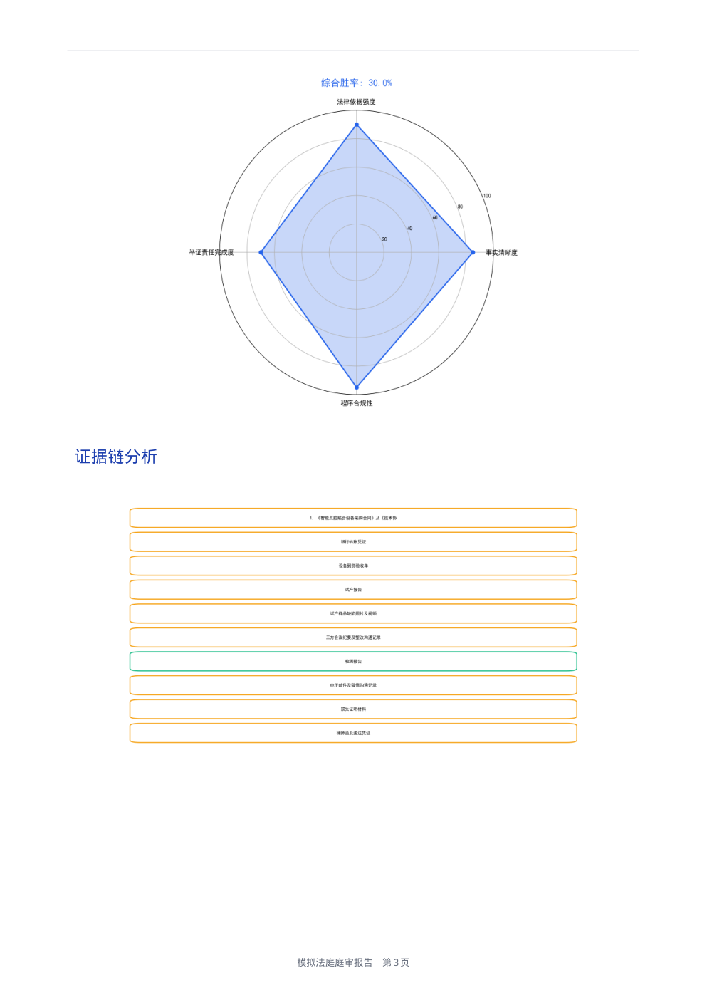
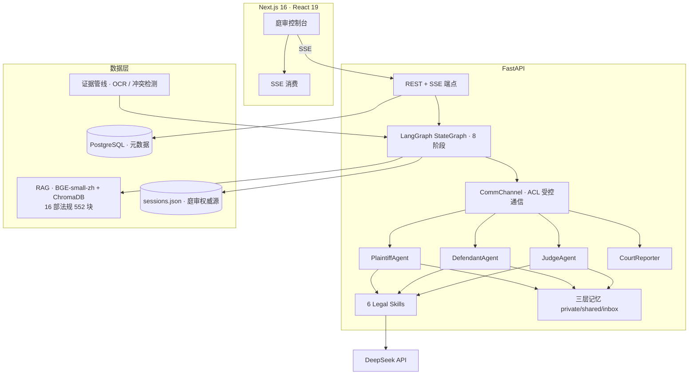

# Moot Court — AI 模拟法庭

> 面向法律学习与实务训练的多 Agent 模拟法庭系统。AI 同时扮演原告律师、被告律师与法官，完整走完 8 阶段民事庭审流程：请求权分析 → 起诉 → 答辩 → 争议焦点归纳 → 交叉询问 → 举证质证 → 最后陈述 → 判决。


---

## Demo

**庭审复盘报告（自动生成 PDF，含可视化图表）**——以下图表全部由真实庭审产出数据渲染：



*案件时间轴（自动从案情事实抽取）与请求权基础树（判决书引用法条 + 诉讼请求拆解）*



*四维度胜率雷达（数据来自判决书胜率评估表）与证据链总览（10 项证据自动归类）*

---

## 它不是套壳聊天

- **多 Agent 编排**：LangGraph 状态机驱动 8 阶段庭审流程，原告 / 被告 / 法官 / 书记员各自持有独立上下文。程序交给状态机，对抗交给 Agent。
- **Actor-Memory-Skill 架构**：每个 Agent 由角色 Actor、三层记忆（private / shared / inbox，对应真实诉讼的信息披露规则）和 6 个可插拔法律 Skill（法律研究 / 文书起草 / 证据分析 / 交叉询问 / 庭审主持 / 裁判）组成。
- **受控通信**：Agent 之间不直接互调，所有消息经 CommChannel 路由，ACL 决定"谁在哪个阶段能对谁说什么"——程序正义是确定性的，不交给模型概率。
- **真实交互**：Phase 6 交叉询问是多轮真实 Agent 对抗（原告提问 → 法官审核 → 被告回答），不是单次 LLM 调用角色扮演双方。
- **RAG 法条检索**：本地化 BGE-small-zh + ChromaDB，16 部民事法规 552 个文本块，庭审关键阶段自动注入检索结果，零 API 成本、离线可用。
- **证据管线**：多模态上传（txt/docx/pdf/jpg/png + OCR）、AI 冲突检测（5 类矛盾），证据自动同步进庭审。

## 功能特性

| 模块 | 功能 |
|------|------|
| **核心庭审** | 8 阶段完整流程 + 条件暂停，用户在关键节点选择策略路线 |
| **单方对抗模式** | 用户扮演原告或被告，AI 担任对手 + 法官，含对抗强度滑块（证据白名单随强度动态调整） |
| **流式输出** | SSE 全链路流式：Phase 1-5 逐字动画，Phase 6 消息级实时气泡 |
| **庭审复盘** | 历史快照 + 任意阶段回退重演；一键导出图文 PDF 报告（时间轴 / 请求权树 / 胜率雷达 / 证据链） |
| **证据系统** | 多模态上传、OCR 提取、AI 冲突检测（时间 / 事实 / 数量 / 当事人 / 立场 5 类矛盾） |
| **案件管理** | 创建 / 重命名 / 删除 / 全局搜索 / 只读分享 |
| **用量管理** | Token 级用量追踪，日 / 月配额限制，用量看板 |
| **用户系统** | JWT + bcrypt，19 个业务端点全部鉴权，用户数据隔离 |

## 架构



## 技术栈

- **前端**：Next.js 16（App Router）· React 19 · TypeScript · Tailwind CSS 4
- **后端**：FastAPI · Python 3.11+ · SSE
- **编排**：LangGraph StateGraph
- **LLM**：OpenAI 兼容接口（DeepSeek 等，可切换）
- **RAG**：ChromaDB + sentence-transformers（`BAAI/bge-small-zh-v1.5`，本地模型离线可用）
- **数据**：PostgreSQL（元数据）+ JSON 持久化（庭审权威源）
- **文档处理**：PyMuPDF / python-docx / pdfplumber / pytesseract

## 快速开始

### 后端

```bash
# 1. 安装依赖
pip install -r requirements.txt

# 2. 配置环境变量（项目根目录 .env）
#    DEEPSEEK_API_KEY / JWT_SECRET_KEY(≥32字符) / DATABASE_URL
#    参考 backend/.env.example

# 3. 启动
uvicorn backend.main:app --host 127.0.0.1 --port 8000
```

### 前端

```bash
cd frontend-next
npm install
npm run dev
# 访问 http://localhost:3000
```

### Windows 一键启动

```bash
launcher.bat
```

## 工程质量

- **全量自我审计**：对全部后端模块 + 前端 18 个组件做了逐文件安全审计，发现 **7 Critical / 11 High**（路径穿越、Zip Slip、JWT 默认密钥、会话静默丢失、双写失效、PDF 注入崩溃等），按 P0–P4 优先级分批整改完毕。
- **回归测试**：63 项回归测试（mock LLM，零 API 成本）覆盖状态流转、证据约束、洞察提取、Agent 持久化等关键行为。

```bash
# 回归测试（无需真实 API Key）
py -m pytest tests/regression/ -v
```

## 目录结构

```
.
├── backend/
│   ├── agents/v2/        # Actor-Memory-Skill Agent 架构
│   ├── orchestration/    # LangGraph 工作流 + 案件分析模型
│   ├── evidence/         # 多模态证据处理（OCR / 冲突检测）
│   ├── rag/              # 检索增强（BGE + ChromaDB）
│   ├── services/         # PDF 报告导出（matplotlib 图表）
│   └── main.py           # FastAPI 入口
├── frontend-next/        # Next.js 16 前端
├── data/                 # 运行时数据（ChromaDB / 上传文件）
├── models/               # 本地 Embedding 模型（离线可用）
├── tests/                # 回归测试套件（mock LLM）
└── docs/                 # 文档与 Demo 图
```

## 文档索引

- 产品路线图：[ROADMAP.md](./ROADMAP.md)
- 技术规范：[TECH_SPEC.md](./TECH_SPEC.md)
- 变更日志：[docs/CHANGELOG.md](./docs/CHANGELOG.md)

## 注意事项

1. **大文件**：仓库包含 `models/bge-small-zh-v1.5/model.safetensors`（约 91 MB），首次 clone 较慢。
2. **环境变量**：JWT 密钥、数据库密码、LLM API Key 均通过 `.env` 管理，未提交到仓库。

## License

MIT
